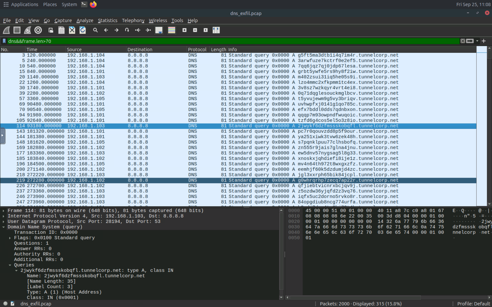
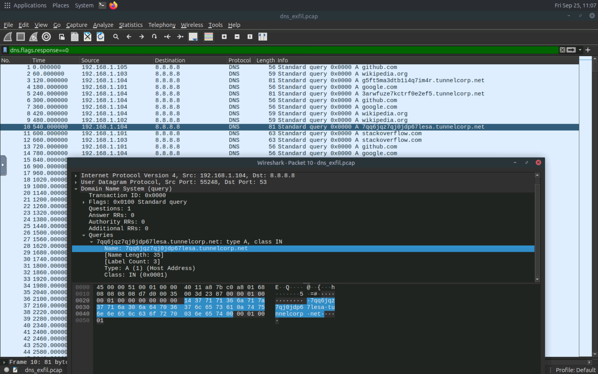
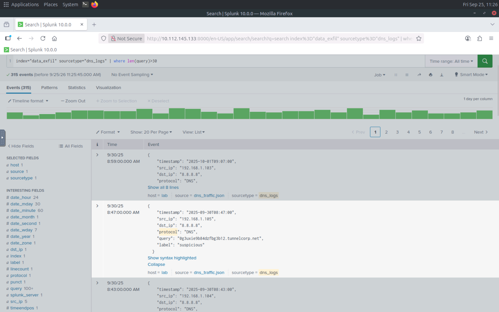
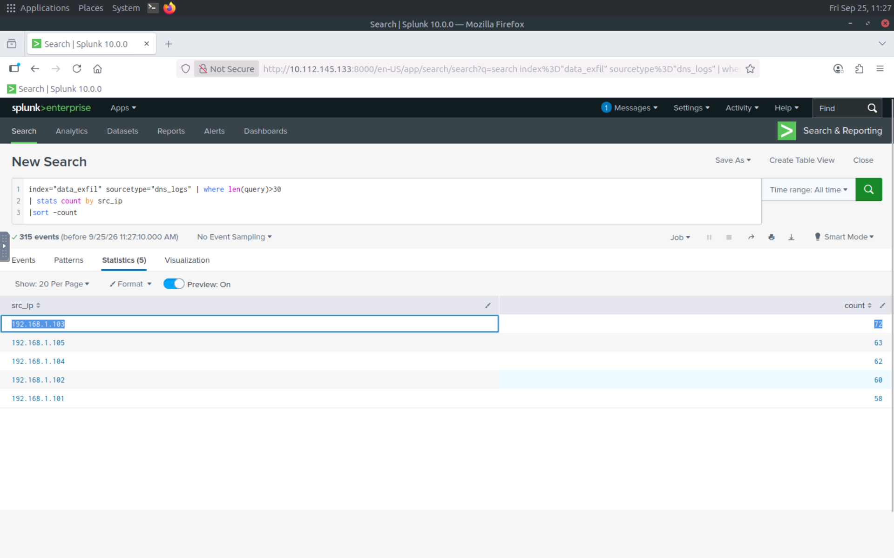

# 🔵 DNS Exfiltration Analysis

## 1. Overview

DNS Exfiltration is a technique that abuses the Domain Name System (DNS) to transfer data through DNS queries and responses.

Because DNS traffic is commonly allowed through firewalls and network gateways, it can be abused as a covert communication channel. Data can be encoded inside DNS query names or responses and transferred in small chunks.

This analysis investigates DNS tunneling activity using both **Wireshark** network traffic analysis and **Splunk** log analysis.

---

## 2. Lab Objective

The objective of this lab was to identify indicators of DNS-based data exfiltration and investigate suspicious DNS traffic using:

* Wireshark
* DNS display filters
* `dns_exfil.pcap`
* Splunk
* DNS log analysis

---

## 3. Traffic Analysis

The provided network capture was analyzed using Wireshark to identify suspicious DNS activity.

### DNS Traffic

The first step was to isolate DNS traffic using:

```text
dns
```

This allows DNS queries and responses to be examined separately from other network traffic.

### DNS Queries Without Responses

The following filter was then used:

```text
dns.flags.response == 0
```

This focuses on DNS queries that do not represent responses.

During the analysis, several DNS entries with unusually large query lengths were identified.

### Identifying Long DNS Queries

The following filter was used to narrow the investigation:

```text
dns && frame.len > 70
```

This revealed suspicious DNS requests containing unusually large amounts of data.

Further investigation focused on the suspicious external domain receiving these DNS queries:

```text
dns && dns.qry.name contains <REDACTED>
```

The traffic indicated that multiple internal hosts were sending data in chunks through DNS queries toward a single external domain.

---

## 4. Indicators of Attack

The analysis identified several indicators associated with DNS tunneling and possible data exfiltration:

* A large number of DNS requests.
* DNS requests without corresponding responses.
* Unusually long DNS queries.
* Multiple internal hosts communicating with the same external domain.
* Data appearing to be transferred in chunks through DNS queries.
* A suspicious external domain receiving the DNS traffic.

These characteristics can help a SOC analyst distinguish potentially malicious DNS activity from normal DNS resolution.

---

## 5. Detection Using Splunk

The DNS activity was correlated with DNS logs in Splunk.

### DNS Log Search

The following search was used to identify DNS log events:

```text
index=data_exfil sourcetype=DNS_logs
```

This search filters the available data to DNS events associated with the `DNS_logs` sourcetype.

### DNS Queries by Source IP

The following query was used to determine how many DNS queries were generated by each source IP:

```text
index="data_exfil" sourcetype="DNS_logs" | stats count by src_ip
```

This helps identify hosts generating unusually high volumes of DNS requests.

### DNS Queries by Domain/Query

The following query was used to count DNS queries and sort them by frequency:

```text
index="data_exfil" sourcetype="dns_logs" | stats count by query | sort -count
```

The results revealed unusual DNS queries with large query sizes and high query counts.

### Detecting Long DNS Queries

The following search was used to identify DNS queries longer than 30 characters:

```text
index="data_exfil" sourcetype="DNS_logs" | where len(query) > 30
```

This helped isolate suspicious-looking DNS queries that could contain encoded or chunked data.

---

## 6. Evidence

### Evidence 1 — DNS Traffic

The Wireshark analysis begins by filtering DNS traffic using:

```text
dns
```



### Evidence 2 — DNS Queries Without Responses

The following filter was used to identify DNS queries without responses:

```text
dns.flags.response == 0
```



### Evidence 3 — Splunk Source IP Analysis

The following screenshot shows the Splunk analysis of DNS queries by source IP.


### Evidence 4 — Splunk DNS Query Analysis

The following screenshot shows the analysis of DNS queries and their frequency in Splunk.



## 7. Defensive Perspective

From a SOC perspective, DNS traffic should be monitored for abnormal patterns that may indicate data exfiltration.

Useful detection indicators include:

* High DNS request volume from a single host.
* Multiple hosts communicating with the same suspicious external domain.
* Unusually long DNS query names.
* Encoded-looking or high-entropy subdomains.
* Large numbers of queries without responses.
* Repeated DNS requests at regular intervals.
* Unusual DNS record types or response sizes.

DNS monitoring, logging, and filtering can help identify suspicious DNS activity before significant data is transferred.

---

## 8. Key Takeaways

* DNS can be abused as a covert channel for data exfiltration.
* Long and unusual DNS queries can be useful detection indicators.
* Multiple hosts sending DNS traffic to the same external domain can indicate coordinated suspicious activity.
* Wireshark can help investigate the network-level evidence.
* Splunk can help correlate DNS logs and identify abnormal query patterns.
* Combining packet analysis with SIEM-based log analysis provides a stronger detection approach.

---

## 9. Lab Environment

* **Platform:** TryHackMe
* **Analysis Tools:** Wireshark, Splunk
* **Network Capture:** `dns_exfil.pcap`
* **Focus:** DNS Tunneling and Data Exfiltration Detection

---

## 10. Disclaimer

This project was conducted in a controlled cybersecurity learning environment for educational and defensive security analysis purposes.

