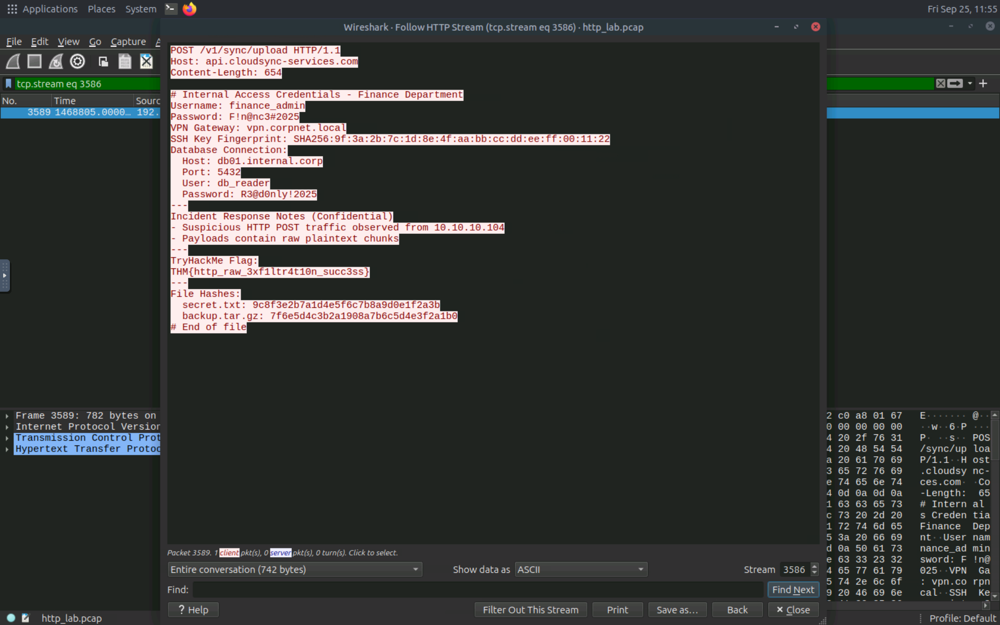
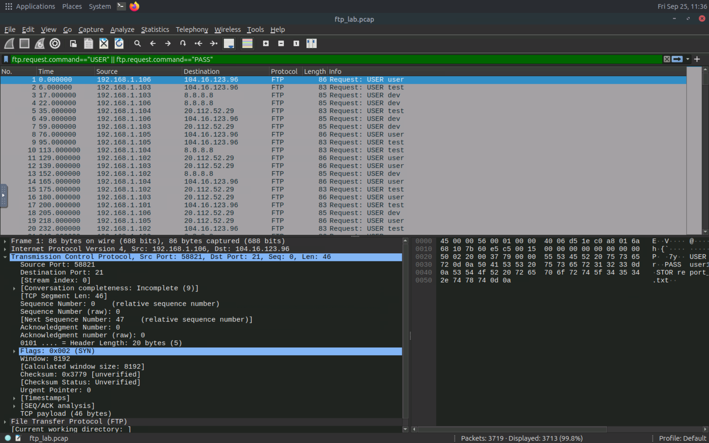

# 🟠 FTP Exfiltration Analysis

## 1. Overview

FTP (File Transfer Protocol) is a protocol used to transfer files between clients and servers over a TCP/IP network.

Attackers can abuse FTP to transfer sensitive or large amounts of data from a compromised environment to an external server.

This analysis investigates potential FTP-based data exfiltration using Wireshark.

---

## 2. Lab Objective

The objective of this lab was to identify suspicious FTP activity and investigate potential data exfiltration through:

* FTP control and data traffic
* FTP commands
* File upload activity
* Wireshark traffic analysis

---

## 3. Traffic Analysis

The `ftp-lab.pcap` capture was analyzed using Wireshark to identify suspicious FTP activity.

### FTP Commands

FTP traffic can contain commands such as `USER`, `PASS`, `STOR`, and `RETR`.

The `STOR` command is particularly relevant when investigating file uploads because it indicates that a file is being sent to an FTP server.

The following filter was used:

```text
ftp contains "STOR"
```

This filter helped identify FTP traffic containing file upload commands.

### FTP Authentication

FTP authentication activity was also investigated using:

```text
ftp.request.command == "USER" || ftp.request.command == "PASS"
```

This filter identifies FTP username and password commands within the captured traffic.

---

## 4. Indicators of Attack

Potential indicators of FTP-based data exfiltration include:

* Use of the `STOR` command to upload files.
* Suspicious FTP authentication activity.
* Large file transfers to external IP addresses.
* Sensitive filenames or file extensions being transferred.
* FTP connections to unusual external destinations.

These indicators can help a SOC analyst investigate suspicious FTP activity and determine whether sensitive data may have been transferred.

---

## 5. Evidence

### Evidence 1 — FTP STOR Command

The following screenshot shows the use of the `STOR` command during the FTP traffic analysis.

```text
ftp contains "STOR"
```



### Evidence 2 — FTP Authentication Commands

The following screenshot shows FTP authentication commands identified using the `USER` and `PASS` filter.

```text
ftp.request.command == "USER" || ftp.request.command == "PASS"
```



---

## 6. Defensive Perspective

From a SOC perspective, FTP traffic should be monitored for suspicious authentication and file-transfer activity.

Useful detection indicators include:

* Unexpected FTP connections.
* Repeated or suspicious authentication attempts.
* Unexpected use of the `STOR` command.
* Large file uploads to external destinations.
* Transfers involving sensitive file types or filenames.
* FTP activity from systems that normally do not use FTP.

Monitoring FTP traffic and server logs can help identify unauthorized file transfers and potential data exfiltration.

---

## 7. Key Takeaways

* FTP can be abused to transfer data from a compromised environment.
* The `STOR` command can indicate file upload activity.
* `USER` and `PASS` commands can reveal FTP authentication activity.
* Wireshark can be used to inspect FTP commands and network traffic.
* FTP traffic should be monitored for unusual authentication and file-transfer behavior.

---

## 8. Lab Environment

* **Platform:** TryHackMe
* **Analysis Tool:** Wireshark
* **Network Capture:** `ftp-lab.pcap`
* **Focus:** FTP Data Exfiltration Detection

---

## 9. Disclaimer

This project was conducted in a controlled cybersecurity learning environment for educational and defensive security analysis purposes.

