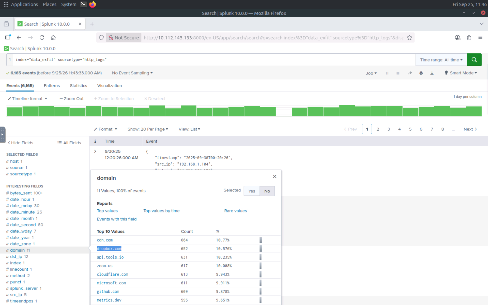
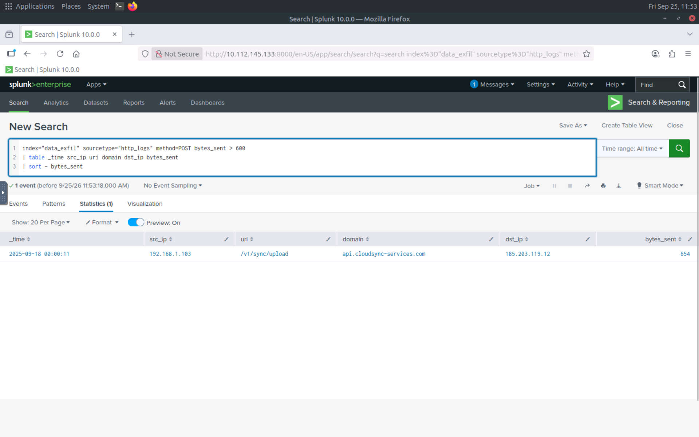
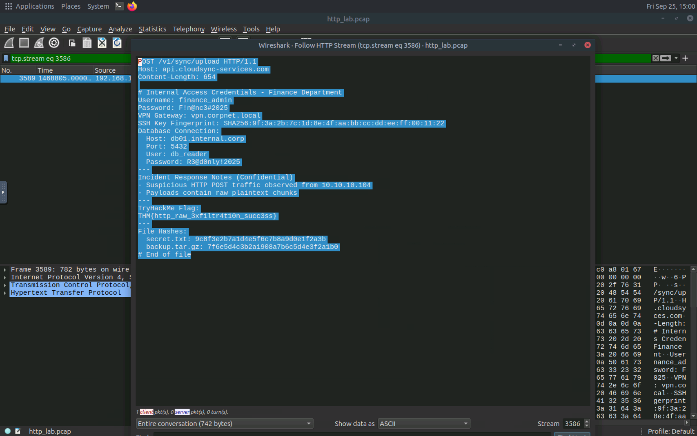

# 🟠 HTTP Exfiltration Analysis

## 1. Overview

HTTP Exfiltration is a technique where an attacker transfers sensitive or stolen data from a compromised system to an external destination using HTTP traffic.

Because HTTP traffic is common in normal network activity, malicious data transfers can sometimes blend into legitimate web traffic.

This analysis focuses on identifying suspicious HTTP POST requests and unusually large HTTP transfers using Splunk and Wireshark.

---

## 2. Lab Objective

The objective of this analysis is to identify potential HTTP-based data exfiltration by:

* Analyzing HTTP logs using Splunk.
* Identifying HTTP POST requests.
* Detecting unusually large amounts of data sent through HTTP.
* Analyzing HTTP traffic using Wireshark.
* Correlating log-based and packet-level evidence.

---

## 3. Traffic Analysis

### HTTP Log Analysis

The following Splunk query was used to search for HTTP logs:

```text
index="data_exfil" sourcetype="http_logs"
```

This provides visibility into HTTP-related events recorded in the `data_exfil` index.

### Large HTTP POST Analysis

To identify potentially suspicious HTTP uploads, the following query was used:

```text
index="data_exfil" sourcetype="http_logs" method=POST bytes_sent > 600 | table _time src_ip uri domain dst_ip bytes_sent | sort - bytes_sent
```

The query focuses on:

* HTTP `POST` requests.
* Requests sending more than 600 bytes.
* Source and destination information.
* Requested URI and domain.
* The amount of data sent.
* Sorting results by the largest amount of transmitted data.

Large POST requests can be worth investigating because HTTP POST requests are commonly used to upload data to a remote server.

---

## 4. Wireshark Analysis

Wireshark was used to inspect the packet-level HTTP traffic.

The following display filter was used:

```text
http.request.method == "POST" and frame.len > 750
```

This filter focuses on HTTP POST requests with a frame length greater than 750 bytes.

Large POST requests can provide packet-level evidence of potentially unusual data transfers and can be correlated with HTTP log activity.

---

## 5. Indicators of Suspicious Activity

The following indicators were investigated during the analysis:

* HTTP POST requests.
* Large HTTP requests.
* High amounts of data transmitted in POST requests.
* External destinations associated with HTTP traffic.
* Repeated or unusual HTTP upload activity.

A single large POST request is not automatically malicious. It should be investigated together with the destination, source system, URI, frequency, and the context of the network activity.

---

## 6. Evidence

### Evidence 1 — HTTP Log Analysis in splunk

Splunk was used to search the available HTTP logs.



### Evidence 2 — Large HTTP POST Analysis in Splunk

Splunk was used to identify POST requests with more than 600 bytes sent and display relevant network information.



### Evidence 3 — Large HTTP POST in Wireshark

Wireshark was used to identify HTTP POST requests with a frame length greater than 750 bytes.



---

## 7. Defensive Perspective

From a SOC perspective, HTTP-based data exfiltration can be investigated by monitoring:

* Large or unusual HTTP POST requests.
* Unexpected external destinations.
* Unusual data transfer volumes.
* Rare or previously unseen domains.
* Repeated upload activity from internal systems.
* HTTP activity that does not match the normal behavior of the affected host.

Correlation between network logs and packet captures can provide stronger evidence than relying on a single data source.

---

## 8. Key Takeaways

* HTTP can be abused to transfer data from compromised systems.
* POST requests are commonly used for sending data to remote servers.
* Large HTTP requests can be an important indicator for investigation.
* Splunk provides centralized visibility into HTTP activity.
* Wireshark provides packet-level visibility for deeper traffic analysis.
* Effective detection requires correlating multiple indicators rather than relying on a single event.

---

## 9. Lab Environment

* **Platform:** TryHackMe
* **Room:** Data Exfiltration Detection
* **Tools:** Splunk, Wireshark
* **Analysis Type:** Defensive Network Traffic Analysis
* **Environment:** Controlled Cybersecurity Lab

---

## 10. Disclaimer

This project was performed in a controlled cybersecurity learning environment for educational and defensive security purposes.

The analysis focuses on understanding data exfiltration indicators and developing network monitoring and detection skills.
